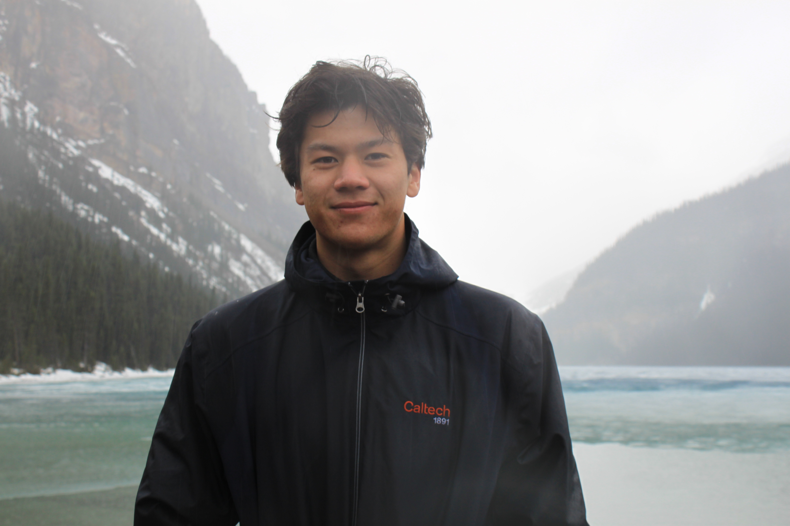

<a href="mailto:rhoffman@caltech.edu">Email</a> / 
<!-- <a href="#">Resume</a> /  -->
<a href="https://scholar.google.com/citations?user=upWNj64AAAAJ&hl=en">Google Scholar</a> / 
<a href="#">Twitter</a> / 
<a href="https://www.linkedin.com/in/richard-hoffmann-27175a22a/">LinkedIn</a> / 
<a href="https://github.com/richardhoff88">Github</a>

<!-- 
{:style="float: right; padding: 30px; max-width: 30%; min-width: 270px;"} -->

 
Hey! I'm Richard, a third-year undergrad at [Caltech](https://www.caltech.edu/) studying Computer Science and minoring in Mathematics + Control & Dynamical Systems (CDS). I'm advised by [Prof. Adam Wierman](https://www.cms.caltech.edu/people/adamw).

I'm particularly interested in applications to self-driving vehicles and intelligent robotics, specifically through spatial reasoning, large language models, model predictive control, and perception/vision.

Right now, I'm researching subsampling within multi-agent RL! I'm also working on LLM post-training to prove polynomial inequalities under [Prof. Tony Yue Yu](https://tyy.caltech.edu/) at [Caltech](https://pma.caltech.edu/). I've previously worked under [Dr. Alec Reed](https://www.colorado.edu/cs/alec-reed) at CU Boulder's [Autonomous Robotics Lab](https://arpg.github.io/) on predictive vehicle dynamics.

I have previously interned at [Commerzbank](https://www.commerzbank.de/group/) in New York City and [Amazon AWS](https://aws.amazon.com/?nc2=h_lg) in Seattle, working on software development.

If you'd like to chat, please reach out at rhoffman@caltech.edu.

## Recent News
last updated: June 2025

- Adversarial attacks on stochastic bandits often rely on unrealistic assumptions like unrestricted, per-round reward manipulation. We introduce a more practical threat model, Fake Data Injection, where the attacker injects a limited number of bounded fake feedback samples. We demonstrate both theoretically and empirically that [Practical Adversarial Attacks on Stochastic Bandits via Fake Data Injection
](https://arxiv.org/abs/2505.21938) can effectively mislead popular algorithms like UCB and Thompson Sampling with minimal attack cost.

- We explore a novel neural population code method to accurately estimate object orientation. I'm excited to see how [Object-Pose Estimation With Neural Population Codes](https://arxiv.org/abs/2502.13403) can be scaled to enhance robot perception and improve autonomous vehicle driving. 