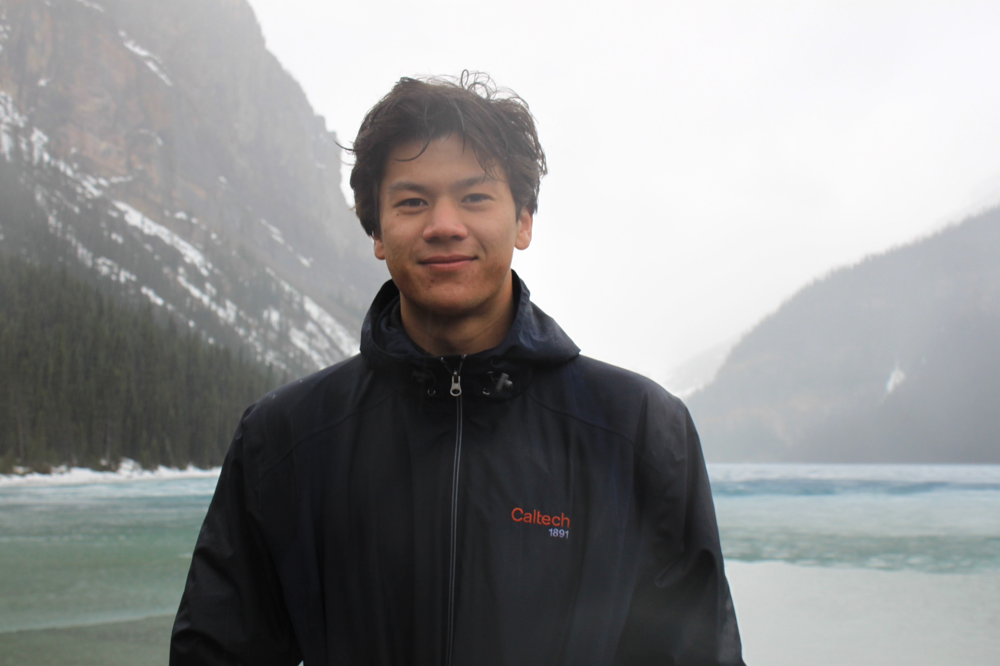

{:style="float: right; padding: 30px; max-width: 20%; min-width: 270px;"}

 
Hey! I'm Richard, a second-year undergrad at [Caltech](https://www.caltech.edu/) studying Computer Science and minoring in Mathematics and Control & Dynamical Systems (CDS). 

My research interests lie in building scalable models for solving hard problems in math and robotics, through reinforcement learning and fine-tuning. I'm particularly interested in applications to self-driving vehicles and intelligent robotics, specifically through spatial reasoning, large language models, model predictive control, and perception/vision.

Currently, I'm working on frameworks for reinforcement learning from human feedback (RLHF) and LLM fine-tuning to prove Olympiad-level (and beyond) inequalities under [Prof. Tony Yue Yu](https://tyy.caltech.edu/) through [Caltech](https://pma.caltech.edu/).  I've previously worked under [Dr. Alec Reed](https://www.colorado.edu/cs/alec-reed) at CU Boulder's [Autonomous Robotics Lab](https://arpg.github.io/) on predictive vehicle dynamics. Outside my research, I have taken classes on Deep Learning, LLM's, Optimal Control, Algorithms, and Markov Chains.

Last summer, I worked on software development and operations research at [Commerzbank](https://www.commerzbank.de/group/) in New York City. I'll be in Seattle this summer interning at [Amazon](https://aws.amazon.com/?nc2=h_lg)!

If you'd like to chat, please reach out at [rhoffman at caltech dot edu].

## Recent News
last updated: Mar 2025
- My dad and I released a paper, my first one! We explore a novel neural population code method to accurately estimate object orientation. I'm excited to see how [Object-Pose Estimation With Neural Population Codes](https://arxiv.org/abs/2502.13403) can be scaled to enhance robot perception and improve autonomous vehicle driving. 